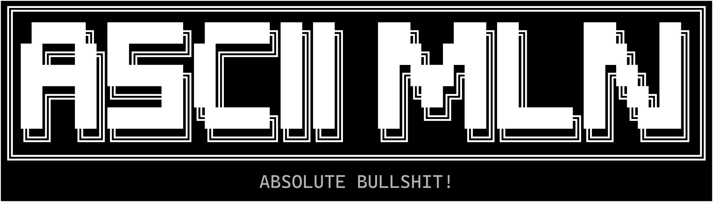

> cool ascii art, i know :P


i made minecraft clone but it renders completely in your terminal lol

## what is it
AsciiMLN is a life-changing game-changing, tide-changing, table-flipping invention by the greatest dev known to fucking mankind.
It renders squares but with some goddamn text.
fucktastic!

## what does it do

- renders a full 3d voxel (means block-based if you dont know) world using ONLY ascii characters, straight into your terminal, like its 1967 or smth
- sum noice noise-based world gen so we dont get superflat
- wasd, space, c for down (shift wasnt working dont ask), and mouse to look around
- only changes the changed chars so it dont gotta do much
- collision (AABB collision 🤓👆) so you dont clip thruough
- works on resize in theory (breaks slightly)
- ~~work in the mines~~ mining was also implemented (DDA Ray casting 🤓👆) with 4.5 blocks distance max to vapourise blocks (no delay lmfao)

## gameplay typa shi

<video src="gameplay_demo.mp4">

## how its built

held together mostly with rust and spite, specifically:

- **`main.rs`**: 760 line long monster that haunts you at night, does basically most of the stuff
- **`framebuffer.rs`**: A Z-buffered 2D character array used to compose frames before they are presented.
- **`rendering`**: Implements the 3D pipeline, including:
    - **Camera**: Handles view and projection matrices.
    - **Pipeline**: Manages vertex projection and triangle rasterization.
- **`world.rs`**: Handles the voxel data structure, chunk management, and procedural generation.
- **`terminal.rs`**: A low-level wrapper around `crossterm` for raw mode management and optimized rendering.

## Controls (this shoulda been higher up but fuck you)

### Start screen
- `Up and Down arrows`: Select menu options (no mouse for aura purposes)
- `Enter`: Confirm selection
- `Any fucking Key`: When in the world seed section, it types 🙀
- `Left / Right arrows`: Moves the typing cursor.. wait for it.. LEFT AND RIGHT 🙀
- `Q`: Quits the game

### In-Game
- `W / A / S / D`: forward, left, back, right movement
- `Space`: Up
- `C`: Down (shift wasn't working, sybau)
- `Esc` or `Ctrl + C`: Releases the cursor lock (i implemented cursor lock losers)
- `Q`: Quits the game
- `H`: Makes you high (coming soon)

## Install on Windows

no 10gb of rust (fabuloos!):

### install it like a normal person (one command)

open PowerShell and paste this in there:

```powershell
irm https://raw.githubusercontent.com/wtrmlnv1/asciimln/main/install.ps1 | iex
```

it downloads the latest version, puts it in your PATH and then you can type this
in any new terminal window forever:

```powershell
asciimln
```

run the install command again later if i somehow make the game less broken.

### download it yourself (if you don't trust commands off the internet, like an overcaffeinated squirrel)

1. go to [Releases](https://github.com/wtrmlnv1/asciimln/releases/latest)
2. download `asciimln-windows-x86_64.exe` (or `asciimln.exe`)
3. double-click it, or open a terminal in that folder and run:

```powershell
.\asciimln-windows-x86_64.exe
```

> The release must include `asciimln-windows-x86_64.exe` (or `asciimln.exe` when
> uploading manually). The included GitHub Actions release workflow creates the
> versioned asset whenever a `v*` tag is pushed.

## Building from source

### Prerequisites
- [Rust](https://www.rust-lang.org/tools/install) (latest stable)

### ~~launch the nuclear bombs~~ run the game
```bash
cargo run
```

### ~~explode your pc~~ build
```bash
cargo build
```

The release executable is `target\release\asciimln.exe`. It is fully self-contained;
all gameplay code is compiled into it.

### legend says i added tests
```bash
cargo test
```

### 🔫⚖️ License
MIT license. do whatever you want (assuming you understand the 31kb main.rs BAHAHA)

---

Built by [WTRMLN](https://www.github.com/wtrmlnv1) with utter hatred :D
